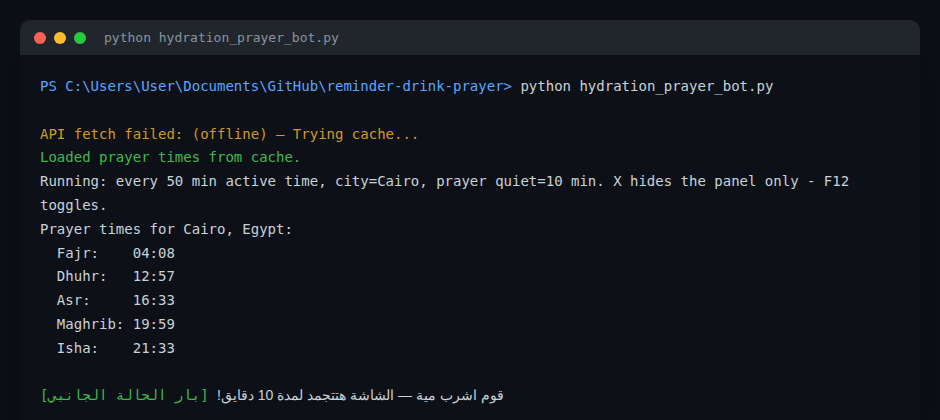

# 💧🕌 Hydration & Prayer Reminder Bot

بوت تذكير شغال في الخلفية على ويندوز، بيفكّرك تشرب مية وتتحرك كل فترة نشاط معينة، وفي نفس الوقت بيحترم أوقات الصلاة في مدينتك بحيث الشاشة تتجمد وقت الصلاة تلقائيًا.

## لقطة من تشغيل السكربت



*(السكربت بيجيب مواعيد الصلاة أونلاين من Aladhan API، ولو مفيش إنترنت لحظتها بيرجع تلقائيًا لآخر نسخة محفوظة في `prayer_cache.json` — زي ما ظاهر في اللقطة.)*

## المميزات

- **تذكير بالشرب والحركة**: بيحسب وقت النشاط الفعلي على الجهاز (مش الوقت اللي الجهاز فاضي فيه)، وكل ما يوصل الفترة المحددة (50 دقيقة افتراضيًا) بيبعت إشعار Windows Toast ويجمّد الشاشة لمدة دقايق معينة عشان تاخد بريك فعلي.
- **احترام مواعيد الصلاة**: بيجيب مواعيد الصلوات الخمسة لمدينتك تلقائيًا من [Aladhan API](https://aladhan.com/) (من غير ما تحتاج مفتاح API)، ويجمّد الشاشة تلقائيًا حوالين وقت كل صلاة.
- **يشتغل حتى بدون إنترنت**: لو الـ API مش متاح، البوت بيستخدم آخر مواعيد صلاة محفوظة في `prayer_cache.json` بدل ما يتوقف.
- **تنبيه قبل الموعد بدقيقة** لكل من الشرب والصلاة، عشان تاخد وقتك تجهّز.
- **شريط حالة عائم صغير** فوق الشاشة بيوريك العدّ التنازلي للصلاة الجاية وموعد الشرب الجاي لحظة بلحظة، وتقدر تخفيه بـ F12.
- **تشغيل تلقائي مع ويندوز** اختياري عبر أمر `--install-startup`.

## طريقة التشغيل

```bash
pip install -r requirements.txt   # requests, winotify, pyyaml (لو موجودة)
python hydration_prayer_bot.py
```

### الإعدادات (اختياري)

انسخ `config.example.yaml` (لو موجود) إلى `config.yaml` بجانب السكربت وعدّل:

```yaml
city: Cairo
country: Egypt
reminder_interval_minutes: 50
idle_threshold_seconds: 120
prayer_quiet_window_minutes: 10
hydration_break_minutes: 10
```

### تشغيله مع بدء ويندوز

```bash
python hydration_prayer_bot.py --install-startup
```

## المتطلبات

- Windows (السكربت بيستخدم واجهات ويندوز الأصلية لقياس وقت الخمول وعرض التنبيهات).
- Python 3.10+.
